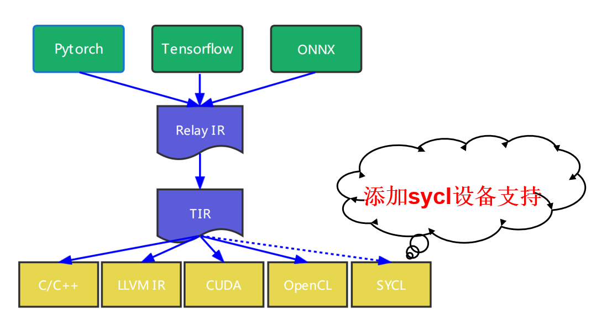
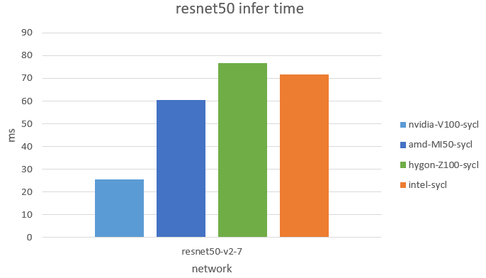
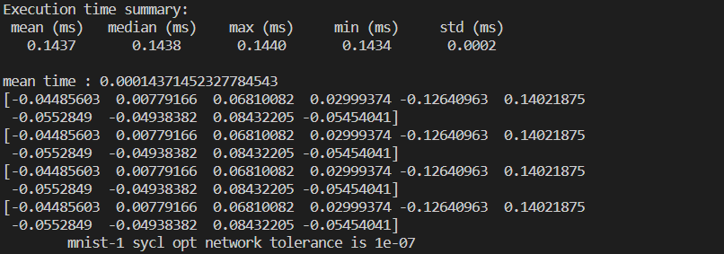
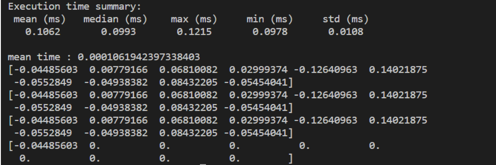
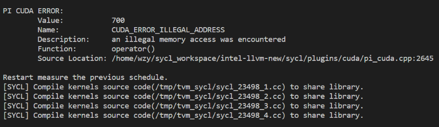
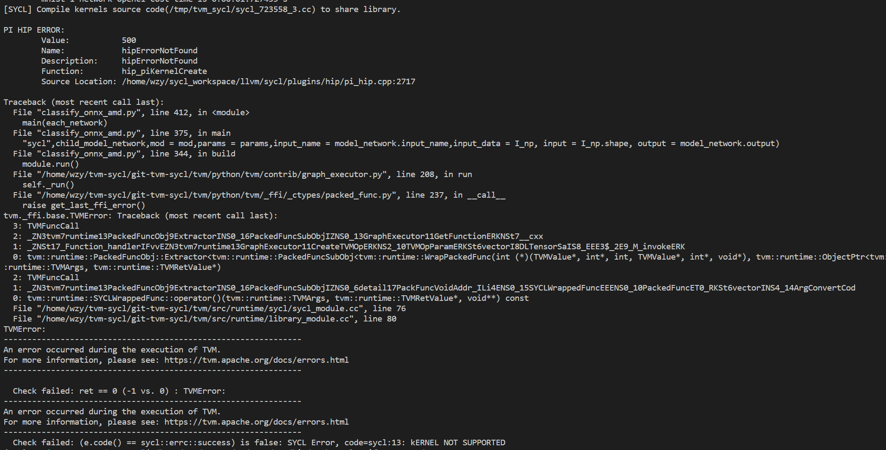
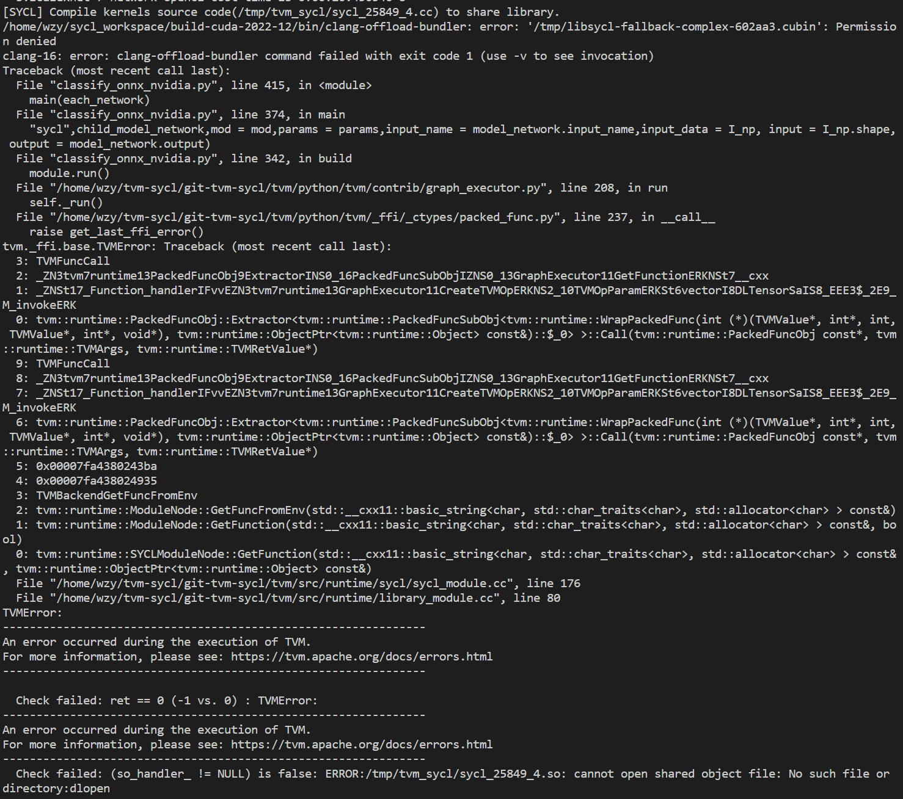
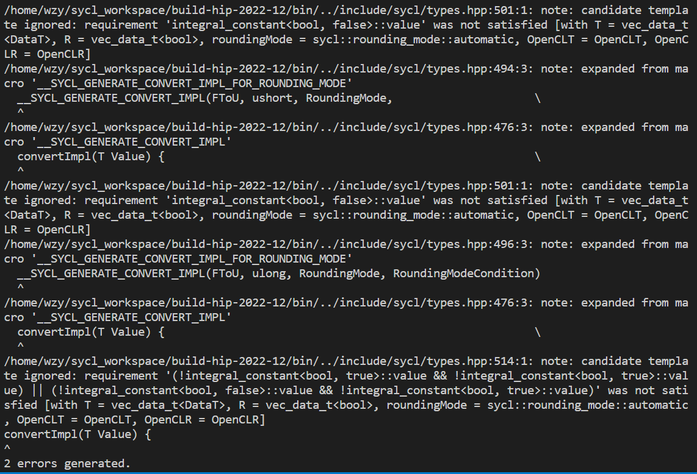
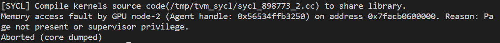
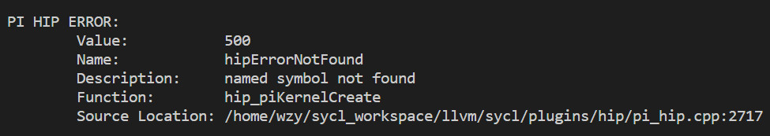

# tvm-sycl测试验证

### 概述

TVM中添加SYCL设备代码支持，相关tvm-sycl代码详见https://github.com/RELOAD22/tvm 的sycl分支

依赖sycl分支详见 http://10.18.127.29:8888/wangziyang/intel-llvm-new 的v2022-12-local-deps分支

目前sycl后端设备已经支持Nvidia、AMD、Hygon三种硬件设备的大多数网络模型。



### 支持网络模型

以下的测试的tvm版本为v.0.10 Release，cuda版本为11.2，hip版本为5.2，hygon版本为5.2，SYCL版本为2022-09-release

cuda平台下测试设备为Tesla V100-32GB，hip平台下测试设备为AMD Radeon (TM) Pro-16GB-gfx-906，oneapi-LevelZero平台下测试设备为Intel Arctic Sound-P-16G 300W，hygon平台下测试设备为Hygon-Z100-33GB-gfx916 . 

Nvidia Tesla V100 测试统计结果 [详见](tvm-nvidia-V100-sycl-test-result/cuda-V100-network-summary-new.xlsx)

Nvidia Tesla V100 测试日志 [详见](tvm-nvidia-V100-sycl-test-result/error_tvm_V100_nvidia_sycl_new.log)

AMD Radeon MI50 测试统计结果 [详见](tvm-amd-MI50-sycl-test-result/rocm-MI50-network-summary-new.xlsx)

AMD Radeon MI50 测试日志 [详见](tvm-amd-MI50-sycl-test-result/error_tvm_MI50_rocm_sycl.log)

Intel Arctic Sound-P 300W测试统计结果 [详见](tvm-intel-ASP300-sycl-test-result/sycl-ASP300-network-summary-new.xlsx)

Intel Arctic Sound-P 300W测试日志 [详见](tvm-intel-ASP300-sycl-test-result/error_tvm_Intel_sycl.log)

| network      | cuda-Nvidia | SYCL-Nvidia                                                  | OpenCL-Nvidia | rocm-AMD                                                     | SYCL-AMD                                          | OpenCL-AMD | rocm-Hygon | SYCL-Hygon         | OpenCL-Hygon | SYCL-Intel         | OpenCL-Intel |
| ------------ | ----------- | ------------------------------------------------------------ | ------------- | ------------------------------------------------------------ | ------------------------------------------------- | ---------- | ---------- | ------------------ | ------------ | ------------------ | ------------ |
| mnist        | √           | √（mnist-1×）                                                | √             | <font color=green>**√** </font>                              | √ (mnist-1 ×)                                     | √          | ×          | √（Log_Error?）    | √            | √                  | √            |
| alexnet      | √           | √                                                            | √             | <font color=green>**√**</font>                               | √                                                 | √          | ×          | √（same as above） | √            | √                  | √            |
| caffenet     | √           | √(caffenet-3 ×)<br />(caffenet-9 ×)                          | √             | <font color=green>**√**  </font>                             | √√ (caffenet-3 ×)<br />(caffenet-9 ×)             | √          | ×          | √（same as above） | √            | √                  | √            |
| densenet     | √           | √                                                            | √             | <font color=green>**√**  </font>                             | √                                                 | √          | ×          | √（same as above） | √            | √                  | √            |
| efficientnet | √           | √                                                            | √             | <font color=green>**√** </font>                              | √                                                 | √          | ×          | √（same as above） | √            | √                  | √            |
| inception    | √           | √                                                            | √             | <font color=green>**√** </font>                              | √                                                 | √          | ×          | ×                  | √            | √                  | √            |
| googlenet    | √           | √                                                            | √             | <font color=green>**√** </font>                              | √（googlenet-3 ×）                                | √          | ×          | ×                  | √            | √                  | √            |
| mobilenet    | √           | √                                                            | √             | <font color=green>**√** </font>                              | √                                                 | √          | ×          | √（same as above） | √            | √                  | √            |
| rcnn         | √           | √                                                            | √             | <font color=green>**√** </font>                              | √                                                 | √          | ×          | √（same as above） | √            | √                  | √            |
| resnet       | √           | √(resnet50-v1-7 ×)<br />(resnet50-caffe2-v1-6 ×)<br/>(resnet101-v2-7 ×) | √             | <font color=green>**√<br/>(resnet152-v1-7 ×)<br />(resnet50-caffe2-v1-3 ×)** </font> | √ (resnet50-v1-7 ×)<br />(resnet50-caffe2-v1-6 ×) | √          | ×          | √（same as above） | √            | √(resnet50-v1-7 ×) | √            |
| shufflenet   | √           | √                                                            | √             | <font color=green>**√** </font>                              | √                                                 | √          | ×          | √（same as above） | √            | √                  | √            |
| squeezenet   | √           | √                                                            | √             | <font color=green>**√** </font>                              | √                                                 | √          | ×          | √（same as above） | √            | √                  | √            |
| vgg          | √           | √(vgg19-caffe2-6 ×)                                          | √             | <font color=green>**√（vgg16-bn-7 ×）** </font>              | √（vgg16-bn-7 ×）(vgg19-caffe2-6 ×)               | √          | ×          | √（same as above） | √            | √                  | √            |
| zfnet        | √           | √                                                            | √             | <font color=green>**√** </font>                              | √                                                 | √          | ×          | √（same as above） | √            | √                  | √            |

tvm-sycl开发测试过程中遇到的bug

| network                                                      | platform       | bug                                                          | progress                                                     |
| ------------------------------------------------------------ | -------------- | ------------------------------------------------------------ | ------------------------------------------------------------ |
| bvlcalexnet-7(alexnet)                                       | cuda           | cuda_piextUSMFree(pi_context, void*): Assertion `type == CU_MEMORYTYPE_DEVICE | fix（fix SYCL plugin USMFree interface）                     |
| any                                                          | hip            | rocm compute result is not correct                           | fix (rocm5.4 add rocm fix on python/tvm/relay/op/strategy/cuda.p) |
| **any**(some time)                                           | cuda/hip/hygon | clang-offload-bundler:error ‘/tmp/libsycl-complex-fp65-complex-fp64-11cc6d.cubin’:permission denied | fix(add CAP_SYS_ADMIN privilege and NVreg_RestrictProfilingToAdminUsers=0) |
| resnet50-caffe2-v1-6（resnet-caffe）&& mnist-1(mnist) && ... | cuda/hip/hygon | Assertion `KSIdMap[EntriesIt->name] == KSIdIt->second && "Kernel sets are not disjoint"' failed | fix（fix SYCL program manager kernel sets check）            |
| any                                                          | cuda/hip/hygon | warning: linking module ''[-Wlinker-warnings]                | fix（fix in 2022-12-release）                                |
| any                                                          | cuda/hip/hygon | warning: linked binaries do not contain expected [-Wsycl-target] | fix（fix in 2022-12-release）                                |
| shuffulenet/efficientnet                                     | hip            | warning:Warning: Unroll hint get ignore at CodeGenLLVM backend,  consider set unroll_explicit=True<br />tvm/tvm/src/target/llvm/codegen_llvm.cc:1503 | unfix                                                        |
| vgg16-7(vgg)（some time）                                    | cuda           | CUDA_ERROR_ILLEGAL_ADDRESS：an illegal memory access was encountered | unfix                                                        |
| vgg16-7                                                      | hip            | PI HIP ERROR： hipErrorNotFound<br />Function:        hip_piKernelCreate<br />/home/wzy/sycl_workspace/llvm/sycl/plugins/hip/pi_hip.cpp:2717 | unfix                                                        |
| googlenet-3                                                  | hip            | Segmentation fault (core dumped)                             | unfix                                                        |
| **any**(some time)<br />resnet152-v1-7<br />resnet50-caffe2-v1-3 | cuda/hip/hygon | Check failed: (e.code() == sycl::errc::success) is false: SYCL Error, code=sycl:13: kERNEL NOT SUPPORTED | unfix                                                        |
| **any**(all time)                                            | hygon          | [LOG_ERROR]: cannot find the function _ZTSZZ39tvmgen_default_ | unfix                                                        |
| inception & googlenet                                        | hygon          | **nan**                                                      | unfix                                                        |

SYCL平台性能

sycl在Nvidia、AMD、Hygon、Intel硬件平台网络模型执行性能。



### 自动优化

测试auto-tuning的tvm版本为v.0.10 Release，cuda版本为11.2，SYCL版本为2022-12-release

cuda平台下测试设备为Tesla V100-32GB

目前测试遇到的问题

| network  | platform  | bug                                                          | progress                                    |
| -------- | --------- | ------------------------------------------------------------ | ------------------------------------------- |
| any      | rocm      | ROCM HIP：invalid device ordinal                             | <font color=green>fix(ROCMDeviceAPI)</font> |
| mnist-1  | sycl/cuda | compute number accuracy                                      | undo(2022-12-release)                       |
| any      | sycl/cuda | PI CUDA ERROR 700 an illegal memory access was encountered(sycl/plugins/cuda/pi_cuda.cpp) | undo                                        |
| google-3 | sycl/hip  | Memory access fault by GPU node-2 (Agent handle: 0x56534ffb3250) on address 0x7facb0600000. Reason: Page not present or supervisor privilege. | undo                                        |

##### bug-1

correct result(sycl-2022-09)



wrong result(sycl-2022-12)



##### bug-2

PI CUDA ERROR



**bug-3**

PI HIP ERROR



**bug_4**

/tmp/libsycl-fallback-xxx.cubin : Permission denied.



**bug-5**

Memory access fault by GPU node-2 (Agent handle: 0x56534ffb3250) on address 0x7facb0600000. Reason: Page not present or supervisor privilege.





**bug-6**

```cpp
pi_result cuda_piKernelCreate(pi_program program, const char *kernel_name,
                              pi_kernel *kernel) {
  assert(kernel != nullptr);
  assert(program != nullptr);

  pi_result retErr = PI_SUCCESS;
  std::unique_ptr<_pi_kernel> retKernel{nullptr};

  try {
    ScopedContext active(program->get_context());

    CUfunction cuFunc;
    retErr = PI_CHECK_ERROR(
        cuModuleGetFunction(&cuFunc, program->get(), kernel_name));

    std::string kernel_name_woffset = std::string(kernel_name) + "_with_offset";
    CUfunction cuFuncWithOffsetParam;
    CUresult offsetRes = cuModuleGetFunction(
        &cuFuncWithOffsetParam, program->get(), kernel_name_woffset.c_str());

    // If there is no kernel with global offset parameter we mark it as missing
    if (offsetRes == CUDA_ERROR_NOT_FOUND) {
      cuFuncWithOffsetParam = nullptr;
    } else {
      retErr = PI_CHECK_ERROR(offsetRes);
    }

    retKernel = std::unique_ptr<_pi_kernel>(
        new _pi_kernel{cuFunc, cuFuncWithOffsetParam, kernel_name, program,
                       program->get_context()});
  } catch (pi_result err) {
    retErr = err;
  } catch (...) {
    retErr = PI_ERROR_OUT_OF_HOST_MEMORY;
  }

  *kernel = retKernel.release();
  return retErr;
}
```



tvm的rocm容器执行网络模型

```shell
docker run -it --device=/dev/dri --device=/dev/kfd --network=host --group-add=render \
-v /home/wzy:/home/wzy rocm-tvm-0.7:5.4.2 /bin/bash


docker run -it --device=/dev/dri --device=/dev/kfd --network=host --group-add=render \
-v /home/wzy:/home/wzy mevermeulen/rocm-tvm:5.4.2 /bin/bash
```

tvm的rocm容器Dockerfile

```dockerfile
FROM rocm/dev-ubuntu-20.04:5.2.3
RUN sed -e 's/debian/5.2.3/g' /etc/apt/sources.list.d/rocm.list > /etc/apt/sources.list.d/rocm5.2.list
RUN rm /etc/apt/sources.list.d/rocm.list
ENV PATH=/opt/rocm/llvm/bin:/usr/local/sbin:/usr/local/bin:/usr/sbin:/usr/bin:/sbin:/bin
ENV DEBIAN_FRONTEND=noninteractive
RUN apt update && apt install -y git wget libz3-dev libxml2-dev openssl libssl-dev libtinfo-dev libprotobuf-dev protobuf-compiler
RUN mkdir /src && cd /src && wget https://github.com/Kitware/CMake/releases/download/v3.17.3/cmake-3.17.3.tar.gz && tar xf cmake-3.17.3.tar.gz && cd cmake-3.17.3 && ./configure && make && make install
RUN apt update && apt install -y rocm-libs miopen-hip
RUN apt update && apt install -y python python-dev python-setuptools gcc libtinfo-dev zlib1g-dev build-essential python3 python3-pip python3-setuptools python3-numpy
# a34731 - ok
# c2eb51 - not ok
RUN cd /src && git clone --recursive https://github.com/mvermeulen/tvm && cd tvm && git checkout rocm-5.2-test
RUN mkdir /src/tvm/build
RUN cd /src/tvm/build && sed -e 's/USE_ROCM OFF/USE_ROCM ON/g' -e 's?USE_LLVM OFF?USE_LLVM /opt/rocm/llvm/bin/llvm-config?g' -e 's/USE_MIOPEN OFF/USE_MIOPEN ON/g' -e 's/USE_ROCBLAS OFF/USE_ROCBLAS ON/g' ../cmake/config.cmake > config.cmake
RUN cd /src/tvm/build && cmake -DCMAKE_CXX_FLAGS="-Wno-deprecated-declarations" .. && make
#RUN pip3 install os-sys
RUN pip3 install -U numpy
RUN cd /src/tvm/python && python3 setup.py install
RUN cd /src && git clone https://github.com/mvermeulen/rocm-tvm
RUN pip3 install scipy psutil xgboost tornado pytest
RUN apt update && apt install -y libomp-dev graphviz rccl libopenblas-dev pciutils
RUN export CMAKE_ARGS=-DONNX_USE_PROTOBUF_SHARED_LIBS=ON
RUN pip3 install jupyter transformers antlr4-python3-runtime graphviz onnx pillow
RUN pip3 install tensorflow
WORKDIR /src/rocm-tvm
```

**bug-7**

TVMError: LLVM module verification failed with the following errors: 

```shell
14.tvm/python/tvm/relay/build_module.py lib = relay.build(mod, target=target, params=params)
13.tvm/python/tvm/relay/build_module.py graph_json, runtime_mod, params = bld_mod.build(mod=ir_mod,
            target=raw_targets,
            params=params,
            executor=executor,
            runtime=runtime,
            workspace_memory_pools=workspace_memory_pools,
            constant_memory_pools=constant_memory_pools,
            mod_name=mod_name,
        )
12.tvm/python/tvm/relay/build_module.py class BuildModule def build(...) : self._build()
11.tvm/python/tvm/_ffi/_ctypes/packed_func.py PackedFuncBase::__call__()
10.src/relay/backend/build_module.cc {} tvm {} relay {} PackedFunc RelayBuildModule::GetFunction(const String& name, const ObjectPtr<Object>& sptr_to_self){}
9.src/relay/backend/build_module.cc {} tvm {} relay {} void RelayBuildModule:: Build(IRModule mod, const Array<Target>& raw_targets, const tvm::Target& target_host,
             const Executor& executor, const Runtime& runtime,
             const WorkspaceMemoryPools& workspace_memory_pools,
             const ConstantMemoryPools& constant_memory_pools, const String mod_name)
8.src/relay/backend/build_module.cc {} tvm {} relay {} backend  void RelayBuildModule::BuildRelay(IRModule relay_module, const String& mod_name) {}
7.src/driver/driver_api.cc {} tvm runtime::Module TIRToRuntime(const Map<Target, IRModule>& inputs_arg,const Target& target_host_arg) {}
6.src/target/codegen.cc {} tvm {} codegen Build(IRModule,Target)
5.include/tvm/runtime/packed_func.h {} tvm {} runtime template <typename R, typename... Args> template <typename FType>
inline void TypedPackedFunc<R(Args...)>::AssignTypedLambda(FType flambda, std::string name){}
4.src/target/llvm/codegen_amdgpu.cc {} tvm {} codegen BuildAMDGPU(IRModule,Target) / 3.src/target/opt/build_cuda_on.cc {} tvm {} codegen BuildCUDA(IRModule,Target)
2.src/target/llvm/codegen_llvm.cc {} tvm {} codegen CodeGenLLVM::Finish()
1.src/target/llvm/codegen_llvm.cc {} tvm {} codegen CodeGenLLVM::Verify() const
```


```
    raise get_last_ffi_error()
tvm._ffi.base.TVMError: Traceback (most recent call last):
  11: TVMFuncCall
  10: tvm::relay::backend::RelayBuildModule::GetFunction(tvm::runtime::String const&, tvm::runtime::ObjectPtr<tvm::runtime::Object> const&)::{lambda(tvm::runtime::TVMArgs, tvm::runtime::TVMRetValue*)#3}::operator()(tvm::runtime::TVMArgs, tvm::runtime::TVMRetValue*) const
  9: tvm::relay::backend::RelayBuildModule::Build(tvm::IRModule, tvm::runtime::Array<tvm::Target, void> const&, tvm::Target const&, tvm::relay::Executor const&, tvm::relay::Runtime const&, tvm::WorkspaceMemoryPools const&, tvm::ConstantMemoryPools const&, tvm::runtime::String)
  8: tvm::relay::backend::RelayBuildModule::BuildRelay(tvm::IRModule, tvm::runtime::String const&)
  7: tvm::TIRToRuntime(tvm::runtime::Map<tvm::Target, tvm::IRModule, void, void> const&, tvm::Target const&)
  6: tvm::codegen::Build(tvm::IRModule, tvm::Target)
  5: _ZN3tvm7runtime13Pac
  4: tvm::runtime::TypedPackedFunc<tvm::runtime::Module (tvm::IRModule, tvm::Target)>::AssignTypedLambda<tvm::runtime::Module (*)(tvm::IRModule, tvm::Target)>(tvm::runtime::Module (*)(tvm::IRModule, tvm::Target), std::__cxx11::basic_string<char, std::char_traits<char>, std::allocator<char> >)::{lambda(tvm::runtime::TVMArgs const&, tvm::runtime::TVMRetValue*)#1}::operator()(tvm::runtime::TVMArgs const&, tvm::runtime::TVMRetValue*) const
  3: tvm::codegen::BuildAMDGPU(tvm::IRModule, tvm::Target)
  2: tvm::codegen::CodeGenLLVM::Finish()
  1: tvm::codegen::CodeGenLLVM::Verify() const
  0: _ZN3tvm7runtime6detail
  File "/home/wzy/native-tvm/tvm/src/target/llvm/codegen_llvm.cc", line 354
  
TVMError: LLVM module verification failed with the following errors: 
Calling convention requires void return type
i32 (float addrspace(1)*, float addrspace(1)*, float addrspace(1)*, float addrspace(1)*)* @tvmgen_default_fused_nn_conv2d_add_nn_relu_1_kernel
Function return type does not match operand type of return inst!
  ret void
 i32Calling convention requires void return type  
```

